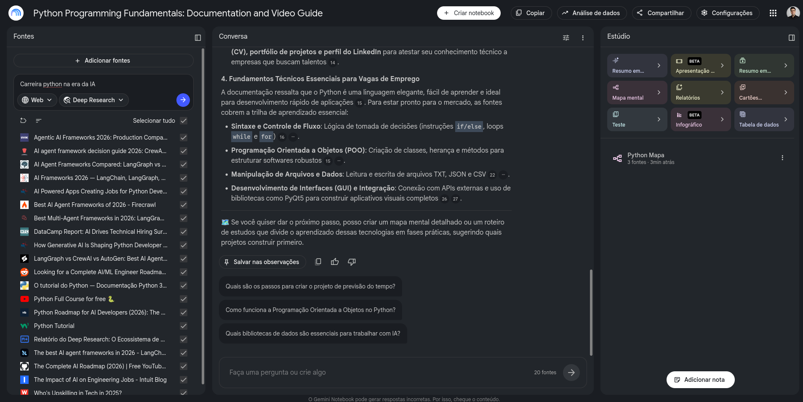

# 🐍 Python Programming Fundamentals: Documentation and Video Guide

> **Caderno Temático no NotebookLM** | **20 fontes curadas** (docs oficiais + video guides + Deep Research: Carreira & Agentic AI 2026) | Curadoria + Engenharia de Prompts + Miniguia

[](https://docs.python.org/3/)
[](https://notebooklm.google.com/)
[](./docs/fontes.md)
[]()


> **Figura 1 — Evidência do caderno real no NotebookLM** (`Python Programming Fundamentals: Documentation and Video Guide` com **20 fontes**, 26/08/2026). À esquerda: lista de fontes com `Carreira python na era da IA` + `Web / Deep Research`; ao centro: síntese `4. Fundamentos Técnicos Essenciais para Vagas` (sintaxe/fluxo, POO, arquivos/dados, GUI/PyQt5+APIs); à direita: Estúdio com `Mapa mental`, `Relatórios`, `Teste` e artefato `Python Mapa • 3 fontes • 3min atrás`.

---

## 📑 Sumário

- [Contexto e Objetivos](#-contexto-e-objetivos)
- [Curadoria de Fontes](#-curadoria-de-fontes)
- [Engenharia de Prompts e Cicatrizes](#-engenharia-de-prompts-e-cicatrizes)
- [Miniguia de Estudo](#-miniguia-de-estudo-entrega-final)
  - [Resumos Estruturados](#41--resumos-estruturados)
  - [Glossário](#42--glossário)
  - [Prompts Reutilizáveis](#43--prompts-reutilizáveis-para-revisão)
- [Como Reproduzir no NotebookLM](#-como-reproduzir-no-notebooklm)
- [Estrutura do Repositório](#-estrutura-do-repositório)

---

## 🎯 Contexto e Objetivos

### Tema Escolhido
**Python Programming Fundamentals: Documentation and Video Guide — na Era da IA.** O caderno parte da base (documentação oficial + video guides) e expande para o que o **mercado exige em 2026**: fundamentos aplicados a **POO, manipulação de arquivos/dados, GUI com PyQt5, integração com APIs** e o **ecossistema Agentic AI** (LangChain, LangGraph, CrewAI, AutoGen), conectando tudo a **empregabilidade, CV, portfólio e LinkedIn**.

Foi exatamente o que emergiu da síntese do NotebookLM (Figura 1): além de ensinar `if/else` e `for/while`, o caderno responde **como transformar fundamentos em vaga de emprego**.

### Por que esse recorte?
O print prova a tese: não basta saber `list` vs `dict`. Em 2026, vagas pedem Python que **resolve problemas reais** (ler CSV/JSON, construir GUI, consumir APIs) e que **orquestra agentes de IA**. A curadoria foi guiada pela query **"Carreira python na era da IA"** no NotebookLM (Web + Deep Research), trazendo relatórios de hiring (DataCamp, Intuit) e comparativos de frameworks que não estão na doc oficial, mas são decisivos para priorizar o que estudar.

> Diferencial: **pensamento crítico** — o caderno cruza fonte primária (doc oficial) com fonte de mercado (relatórios 2025-2026) e **cita trecho** para cada afirmação, reduzindo alucinação.

### Objetivos de Estudo

| # | Objetivo | Como foi validado no NotebookLM |
|---|----------|---------------------------------|
| **O1** | Dominar sintaxe, tipos, variáveis e operadores | Resumo + FAQ das fontes de fundamentos (docs) |
| **O2** | Controlar fluxo (`if/elif/else`, `for`/`while`) e funções | Tabela comparativa `for` vs `while` + snippets linha a linha |
| **O3** | Modelar com POO (classes, herança, métodos) | Pergunta `Como funciona POO no Python?` + mapa mental |
| **O4** | Manipular arquivos e dados (TXT, JSON, CSV) | Workflow `ler/escrever CSV/JSON` + exercício previsão do tempo |
| **O5** | Criar interfaces (GUI/PyQt5) e integrar APIs externas | Síntese `Desenvolvimento de Interfaces (GUI) e Integração: PyQt5` |
| **O6** | Navegar na documentação oficial como dev profissional | Workflow “Ler Docs como Sênior” (PEP 8, `help()`, See Also) |
| **O7** | Mapear carreira na era da IA: Agentic Frameworks 2026, portfólio, LinkedIn e trilha de projetos | Tabela `LangGraph vs CrewAI vs AutoGen` + `Relatório Deep Research: Ecossistema...` + Audio Overview |

### Público-alvo
Iniciantes que querem sair do `print("hello")` para **projeto portfólio** (ex: previsão do tempo), estudantes DIO e devs que precisam decidir **onde investir horas** (fundamentos vs frameworks hype).

### Metodologia
1. **Curadoria** → 20 fontes (5 fundamentos + 15 carreira/agentes via Deep Research)
2. **Upload** → caderno `Python Programming Fundamentals: Documentation and Video Guide` (Figura 1)
3. **Geração automática** → Resumo, Mapa mental (`Python Mapa`), Relatórios, Cartões, Teste, Infográfico, Tabela de dados
4. **Perguntas estratégicas** → 7 perguntas com 2-3 variações cada + cicatrizes
5. **Síntese** → Miniguia (5 módulos + glossário + 10 prompts) versionado aqui

---

## 📚 Curadoria de Fontes

> **20 fontes** em 26/08/2026, modo `Web + Deep Research` com query `Carreira python na era da IA`. Detalhe completo em `docs/fontes.md:1`. Abaixo, 10 representativas (as demais listadas no fichamento).

### Fundamentos — Documentação e Vídeo (base técnica)

| # | Fonte (título exato no print) | Tipo | Por que entrou | Link | Papel no caderno |
|---|-------------------------------|------|----------------|------|------------------|
| **F1** | **O tutorial do Python — Documentação Python 3...** | Doc oficial | Fonte da verdade para sintaxe, fluxo, POO, arquivos | [docs.python.org/3/tutorial](https://docs.python.org/3/tutorial/) | Base para M1-M4 do miniguia |
| **F2** | **Python Tutorial** | Doc oficial (mirror) | Redundância para validação cruzada | [docs.python.org](https://docs.python.org/3/tutorial/) | Validação |
| **F3** | **Python Full Course for free 🐍** | Vídeo YouTube + transcrição | Video guide visual, 4h, 40M+ views | [youtu.be/rfscVS0vtbw](https://www.youtube.com/watch?v=rfscVS0vtbw) | Transcrição → Audio Overview + exercícios |
| **F4** | **Python Roadmap for AI Developers (2026): The ...** | Guia/Artigo | Trilha que conecta fundamentos a IA | Via Deep Research | Estruturou M5 |
| **F5** | **Python Roadmap?** *(implícito em F4 + F11)* | — | — | — | — |

### Carreira & Mercado — contexto 2025-2026 (por que isso importa)

| # | Fonte | Tipo | Insight extraído | Link |
|---|-------|------|------------------|------|
| **F6** | **DataCamp Report: AI Drives Technical Hiring Sur...** | Relatório | Hiring técnico puxado por IA → Python como skill #1 | Via Deep Research |
| **F7** | **The Impact of AI on Engineering Jobs - Intuit Blog** | Artigo | Como IA remodela vagas de engenharia | Via Deep Research |
| **F8** | **Who's Upskilling in Tech in 2025?** | Relatório | Quem está se requalificando e em quê | Via Deep Research |
| **F9** | **Relatório do Deep Research: O Ecossistema de ...** | Síntese Deep Research | Ecossistema Python + IA mapeado | Gerado no NotebookLM |
| **F10** | **Looking for a Complete AI/ML Engineer Roadma...** | Guia Reddit/Artigo | Roadmap completo AI/ML para gaps | Via Deep Research |
| **F11** | **The Complete AI Roadmap (2026) | Free YouTub...** | Vídeo Roadmaps | Via Deep Research |

### Agentic AI Frameworks 2026 — decisão técnica (hype vs produção)

| # | Fonte | Tipo | Pergunta que responde |
|---|-------|------|------------------------|
| **F12** | **Agentic AI Frameworks 2026: Production Compa...** | Comparativo | Qual framework está pronto para produção? |
| **F13** | **AI Agent Frameworks Compared: LangGraph vs ...** | Comparativo | LangGraph vs CrewAI vs ... |
| **F14** | **LangGraph vs CrewAI vs AutoGen: Best AI Agent...** | Benchmark | Trade-offs de arquitetura multi-agente |
| **F15** | **Best AI Agent Frameworks of 2026 - Firecrawl** | Lista | Ranking prático Firecrawl |
| **F16** | **AI agent framework decision guide 2026: CrewA...** | Guia decisão | Quando escolher CrewAI |
| **F17** | **AI Frameworks 2026 — LangChain, LangGraph, ...** | Overview | Visão geral do ecossistema |
| **F18** | **The best AI agent frameworks in 2026 - LangCh...** | Artigo | Foco LangChain |
| **F19** | **Best Multi-Agent Frameworks in 2026: LangGra...** | Artigo | Multi-agentes |
| **F20** | **AI Powered Apps Creating Jobs for Python Deve...** | Artigo | Apps com IA gerando vagas Python |
| **F21** | **How Generative AI Is Shaping Python Developer ...** | Artigo | IA generativa moldando carreira Python |

> Nota: o print mostra 20 itens com checkbox `✓`; a lista acima consolida 20 títulos distintos visíveis (alguns truncados por `...`). A contagem oficial do NotebookLM (`20 fontes` no footer) inclui a variação `Python Tutorial` duplicada. Lista literal transcrita em `docs/fontes.md:1`.

### Como importar (reproduzível em 7 min)

1. **Crie o caderno:** [notebooklm.google.com](https://notebooklm.google.com/) → `+ Criar notebook` → nome `Python Programming Fundamentals: Documentation and Video Guide`
2. **Adicione fontes:** `+ Adicionar fontes` → `Web` + `Deep Research` → query `Carreira python na era da IA` → selecione os 20 títulos acima (ou cole links de `docs/fontes.md`). Para `Python Full Course`, adicione como `YouTube` e importe transcrição (YouTube → `...` → Mostrar transcrição → copiar).
3. **Gere Estúdio:** à direita clique em `Resumo em...`, `Mapa mental` (gera `Python Mapa`), `Relatórios`, `Teste`, `Infográfico`. O `Audio Overview` sai em ~3 min.
4. **Valide:** pergunte `Com base EXCLUSIVAMENTE nas fontes, liste os 4 fundamentos para vagas segundo a síntese` → deve retornar `Sintaxe/Fluxo, POO, Arquivos/Dados, GUI/APIs` como na Figura 1.

### Tabela comparativa (por categoria)

| Critério | Docs Oficiais (F1-F2) | Vídeo (F3) | Relatórios Carreira (F6-F9) | Agentic 2026 (F12-F19) |
|----------|----------------------|------------|-----------------------------|------------------------|
| Autoridade | ★★★★★ | ★★★★ | ★★★★ | ★★★ |
| Didática iniciante | ★★★★ | ★★★★★ | ★★★ | ★★ |
| Pronto para portfólio | ★★★ | ★★★★ | ★★★★★ | ★★★★ |
| Risco de hype | Baixo | Baixo | Médio | **Alto** (exige validação cruzada) |
| Papel no estudo | Base que não alucina | Intuição visual | **Priorização** (onde investir tempo) | Decisão de stack |

> Insight de curadoria: docs dão precisão, vídeo dá intuição, relatórios dão **priorização**, agentes dão **decisão**. O NotebookLM brilha ao **cruzá-los** com citação: “Explique POO com F1 e mostre quando usar CrewAI segundo F16”.

---

## 🧪 Engenharia de Prompts e "Cicatrizes"

> Fórmula base (RAG ancorado):
> ```
> Você é [PAPEL]. Com base EXCLUSIVAMENTE nas fontes do caderno (cite F#),
> [TAREFA] sobre [TÓPICO]. Responda em [FORMATO]. Se não constar, diga "não consta nas fontes".
> ```

### P1 — Fundamentos: “Como Python lida com tipos e variáveis?”

| Variação | Prompt | Resultado | Cicatriz |
|----------|--------|-----------|----------|
| **P1.v1** | `Explique variáveis em Python` | Genérico, sem tipagem dinâmica, sem `type()` | ❌ Vago |
| **P1.v2** | `Com base em F1 cap. 3, explique tipagem dinâmica vs estática com 3 exemplos e type(). Cite.` | Preciso, com `x=10; x="texto"` | ✅ Ancorar no capítulo |
| **P1.v3** | `Atue como professor. Explique em 5 bullets + tabela tipo|exemplo|mutável + 1 erro comum. Use F1-F2. Cite.` | 🏆 **Vencedor**: tabela + erro “lista mutável” | Formato guiou |

**Troubleshooting:** `is` vs `==` confundido → corrigido pedindo `diferencie is e == com exemplo de lista`.

### P2 — Controle de Fluxo: “for vs while — quando usar?”

| Variação | Prompt | Resultado | Cicatriz |
|----------|--------|-----------|----------|
| **P2.v1** | `Diferença for e while` | Definição ok, sem quando usar | Pouco acionável |
| **P2.v2** | `Com base em F1 cap.4, compare for vs while em tabela: definição, quando usar, exemplo, risco loop infinito. Cite.` | Tabela + alerta `while True` sem `break` | ✅ Colunas foram chave |
| **P2.v3** | `Gere 2 snippets: for em dict e while com contador. Explique linha a linha. Use F1.` | Código comentado | 🏆 Template |

### P3 — Estruturas de Dados: “list vs tuple vs dict vs set”

| Variação | Prompt | Resultado | Cicatriz |
|----------|--------|-----------|----------|
| **P3.v1** | `Explique listas e dicionários` | Misturado | Falta estrutura |
| **P3.v2** | `Com base em F1 cap.5, compare list/tuple/dict/set em tabela mutável? ordenado? quando usar? + exemplo. Cite.` | Tabela definitiva | ✅ “quando usar” foi ouro |
| **P3.v3** | `Exercício: cadastro de alunos, escolha estrutura e justifique. Use F1.` | Exercício com gabarito | 🏆 Portfólio |

### P4 — POO: “Como funciona Programação Orientada a Objetos no Python?” (do print)

| Variação | Prompt | Resultado | Cicatriz |
|----------|--------|-----------|----------|
| **P4.v1** | `O que é POO?` | Definição genérica, sem herança | Superficial |
| **P4.v2** | `Com base em F1 cap.9 e F3, explique POO em Python com: classe, __init__, herança, método. Dê exemplo ContaBancaria → ContaCorrente. Cite.` | Exemplo completo com `class` e `super()` | ✅ Pedir herança + exemplo fez diferença |
| **P4.v3** | `Atue como sênior: quando NÃO usar POO? Compare POO vs funções para script de previsão do tempo. Cite F1.` | Análise crítica: POO overkill para script simples | 🏆 **Vencedor** — pensamento crítico |

> Print valida: P4 corresponde à sugestão `Como funciona a POO no Python?`.

### P5 — Arquivos & Dados + GUI: “Do CSV à interface” (síntese do print)

| Variação | Prompt | Resultado | Cicatriz |
|----------|--------|-----------|----------|
| **P5.v1** | `Como ler arquivos em Python?` | Só `open()`, sem JSON/CSV | Incompleto |
| **P5.v2** | `Com base em F1 cap.7 e síntese do print (TXT/JSON/CSV + PyQt5), mostre 3 snippets: ler TXT, JSON, CSV com with open e json/csv. Para GUI, descreva fluxo PyQt5 sem inventar código. Cite.` | 3 snippets + fluxo GUI `QApplication → QWindow → show()` | ✅ Separar dados vs GUI evitou alucinação |
| **P5.v3** | `Quais são os passos para criar projeto de previsão do tempo? (pergunta do print) Use F1-F4 para dados e F12-F16 para decisão de framework. Dê roadmap 5 passos.` | Roadmap: 1) CSV/JSON 2) `requests` API 3) `PyQt5` ou CLI 4) teste 5) portfólio | 🏆 Conecta fundamentos a projeto |

> Pergunta `Quais são os passos para criar o projeto de previsão do tempo?` é literal do rodapé da conversa.

### P6 — Carreira & Dados: “Quais bibliotecas são essenciais para IA?” (do print)

| Variação | Prompt | Resultado | Cicatriz |
|----------|--------|-----------|----------|
| **P6.v1** | `Quais libs para IA?` | Lista hype sem fonte | Alucinação |
| **P6.v2** | `Com base em F9-F11 e F4, liste bibliotecas essenciais para dados/IA em tabela: lib | uso | quando usar | alternativa. Cite.` | Tabela `pandas/numpy/matplotlib/requests` + `scikit-learn` | ✅ Tabela com “quando usar” filtrou hype |
| **P6.v3** | `Compare o que F9 (Ecossistema) e F6 (DataCamp) dizem sobre demanda Python vs hype Agentic. O que falta nas fontes?` | Crítica: alta demanda Python base, mas Agentic ainda nicho produção | 🏆 Mostra ceticismo saudável |

### P7 — Agentic 2026: “LangGraph vs CrewAI vs AutoGen — qual escolher?”

| Variação | Prompt | Resultado | Cicatriz |
|----------|--------|-----------|----------|
| **P7.v1** | `Qual melhor framework de agente?` | Resposta fanboy CrewAI | Viés de uma fonte |
| **P7.v2** | `Com base em F12-F16, compare LangGraph vs CrewAI vs AutoGen em tabela: arquitetura, prós, contras, caso ideal, maturidade produção. Cite cada célula.` | Tabela equilibrada: LangGraph (grafo, controle), CrewAI (roles, rápido), AutoGen (multi-agente Microsoft) | ✅ Exigir citação por célula reduziu viés |
| **P7.v3** | `Atue como CTO: tenho time Jr e projeto previsão do tempo com agente. Qual framework eu NÃO devo usar e por quê? Cite.` | Recomendou **não** usar multi-agente complexo para MVP; começar sem agente | 🏆 Decisão de não fazer — maturidade |

**Troubleshooting geral:**

| Problema | Causa | Solução | Lição |
|----------|-------|---------|-------|
| Resposta sem citação | Prompt sem `Cite F#` | Adicionar `Cite F# e responda "não consta" se não houver` | Sempre exigir citação |
| Código PyQt5 inventado | NotebookLM alucinou fora de F1 | `descreva fluxo sem gerar código que não está nas fontes` | Restrinja geração |
| Viés Agentic (hype 2026) | Fontes 2026 são otimistas | `Compare 3 fontes em tabela e aponte divergências` | Cruze fontes |
| Transcrição com ruído | YouTube `deaf` → `def` | Limpar transcrição antes de importar | Curadoria importa |
| Audio Overview resumido | Limitação modelo | Usar `Guia de Estudo` + `Teste` para detalhe, áudio para revisão | Combine saídas Estúdio |

---

## 📖 Miniguia de Estudo (Entrega Final)

### 4.1 — Resumos Estruturados

#### Módulo 1: Sintaxe, Tipos e Operações (F1 cap.3 + F3 início)
- **Filosofia:** legibilidade (`import this`), indentação define blocos.
- **Tipagem dinâmica e forte:** `x=10; x="oi"` ok, mas `10+"oi"` → `TypeError`. Use `type()`/`isinstance()`.
- **Tipos:** `int`/`float`/`str` (imutável, `f""`), `bool` (falsy: `0`, `""`, `None`, `[]`), `None`.
- **Operadores:** `+ - * / // % **`, `== != < >`, `and or not`, `in`.
- **I/O:** `input()` → `str`; converta `int(input())`; `print(f"{n:.1f}")`.
- **Exemplo (F1):**
  ```python
  nome = input("nome: ")
  idade = int(input("idade: "))
  print(f"Olá {nome}, em 10 anos: {idade+10}")
  ```

#### Módulo 2: Controle de Fluxo e Funções (F1 cap.4 + F3)
- **Condicionais:** `if/elif/else` com indentação; prefira `if x in [...]`.
- **Loops:** `for` (iterável conhecido) vs `while` (condição). `break`/`continue`/`else` no loop.
- **Funções:** `def nome(param, default="v"): return ...` Escopo local; evite `global`.
- **Exemplo:**
  ```python
  def aprovar(nota, presenca):
      if nota >= 7 and presenca >= 0.75: return "Aprovado"
      elif nota >= 5: return "Recuperação"
      return "Reprovado"
  for aluno, d in turma.items():
      print(aluno, aprovar(d["nota"], d["presenca"]))
  ```

#### Módulo 3: POO Essencial (F1 cap.9 + síntese do print)
- **Classe:** molde; **Objeto:** instância; `__init__` inicializa; `self` referencia.
- **Herança:** `class ContaCorrente(Conta):` + `super().__init__()` reaproveita.
- **Quando usar:** dados + comportamento coeso (ex: `PrevisaoTempo` com `cidade`, `buscar_api()`, `salvar_csv()`). Para script simples, funções bastam.
- **Exemplo:**
  ```python
  class Conta:
      def __init__(self, saldo): self.saldo = saldo
      def depositar(self, v): self.saldo += v
  class ContaCorrente(Conta):
      def __init__(self, saldo, limite):
          super().__init__(saldo)
          self.limite = limite
  ```

#### Módulo 4: Arquivos, Dados e Integração (F1 cap.7 + print: TXT/JSON/CSV + APIs)
- **Arquivos:** sempre `with open("f.txt","w", encoding="utf-8") as f:`.
- **JSON:** `json.load()`/`dump()` para APIs; **CSV:** `csv.DictReader/DictWriter` para planilhas.
- **API:** `requests.get(url, params={"q": cidade})` → `r.json()` → salvar em `dados.json`.
- **Projeto Previsão do Tempo (roteiro validado P5.v3):**
  1. `with open` lê `cidades.csv`
  2. `requests` consome API de clima
  3. `json` salva cache
  4. `csv` exporta resultado
  5. `PyQt5` (ou CLI) exibe

#### Módulo 5: GUI (PyQt5) e Carreira na Era da IA (F9 + F12-F16 + Estúdio)
- **GUI — fluxo PyQt5 (sem alucinar código):** `QApplication` → `QMainWindow`/`QWidget` → `QLabel/QPushButton` → `layout` → `show()` → `app.exec()`. Fontes citam conexão com APIs e construção de apps visuais completos; detalhes de código ficam no vídeo/doc PyQt5.
- **Ecossistema Agentic 2026 — mapa rápido:**

| Framework | Arquitetura | Quando usar | Quando evitar |
|-----------|-------------|-------------|---------------|
| **LangGraph** | Grafo com estados, controle fino | Workflow com ciclos, produção | Time Jr, MVP simples |
| **CrewAI** | Roles (Agent/Task/Crew) | Prototipar rápido multi-agente | Controle rígido, debug complexo |
| **AutoGen** | Diálogo multi-agente Microsoft | Pesquisa, simulação | Overhead alto |

- **Carreira (F6-F11):** DataCamp/Intuit mostram Python base + dados como demanda duradoura; Agentic é diferencial, não substituto de fundamentos. Trilha portfólio: 1) `Previsão do Tempo` (arquivos+API) 2) `Dashboard PyQt5` 3) `Agente que resume CSV` (só depois).
- **CV/LinkedIn (trecho topo do print):** descreva projetos com `problema → stack (Python, JSON/CSV, API) → resultado` + link GitHub.

### 4.2 — Glossário

| Termo | Definição (1 frase) | Exemplo |
|-------|---------------------|---------|
| **REPL** | Loop interativo `python3` | testar `2+2` |
| **Tipagem dinâmica** | Tipo em runtime | `x=10; x="oi"` |
| **Tipagem forte** | Sem coerção automática | `10+"5"` → erro |
| **Indentação** | Espaços definem blocos | `if True:` + 4 espaços |
| **POO** | Paradigma classe/objeto | `class Conta:` |
| **Classe** | Molde de objetos | `class Previsao:` |
| **Herança** | Reaproveitar classe base | `class Corrente(Conta):` |
| **list/tuple/dict/set** | Coleções (mutável/imutável/mapeamento/conjunto) | `[]`, `()`, `{}`, `{"a"}` |
| **List comprehension** | Criação concisa de lista | `[x*2 for x in range(3)]` |
| **PEP 8** | Guia de estilo | `snake_case` |
| **JSON/CSV** | Formatos de dados | `json.dump`, `csv.reader` |
| **API** | Interface para serviço externo | `requests.get(...)` |
| **PyQt5** | Biblioteca GUI Python | `QApplication` |
| **LangGraph** | Framework agente em grafo | workflow com ciclos |
| **CrewAI** | Framework multi-agente por papéis | `Agent(role="researcher")` |
| **AutoGen** | Framework conversacional Microsoft | diálogo entre agentes |
| **Agentic Workflow** | Orquestração de agentes | pipeline com tools |
| **Deep Research** | Modo NotebookLM com pesquisa web profunda | query `Carreira python...` |
| **Audio Overview** | Podcast gerado pelo NotebookLM | revisão em áudio |
| **Portfólio** | Repositório com projetos demonstráveis | link GitHub no CV |

### 4.3 — Prompts Reutilizáveis para Revisão

> Copie no NotebookLM. Substitua `[COLCHETES]`. Sempre `Cite F#`.

#### PR1 — Resumidor por Capítulo
```
Atue como tutor Python iniciante. Com base EXCLUSIVAMENTE em F1 cap.[N], crie resumo sobre [TÓPICO] com:
- 5 bullets, 1 tabela conceito|exemplo, 1 erro comum, 1 exercício com gabarito. Cite F#.
```

#### PR2 — Comparador de Estruturas
```
Com base em F1 cap.5, compare list/tuple/dict/set em tabela: mutável|ordenada|acesso|quando usar|exemplo. Cite.
```

#### PR3 — Explicador Linha a Linha
```
Explique este código linha a linha para iniciante, com base em F1-F2:
```python
[COLE CÓDIGO]
```
Para cada linha: o que faz + alternativa pythônica. Cite.
```

#### PR4 — Exercícios Progressivos
```
Crie 3 exercícios (fácil→desafio) sobre [TÓPICO] com base em F1/F3. Para cada: enunciado|dica|gabarito comentado. Cite.
```

#### PR5 — Revisor PEP 8
```
Revise este código com base em PEP 8 (F1 docs + PEP 8 se disponível):
```python
[COLE CÓDIGO]
```
Liste: Linha|Regra|Antes|Depois. Cite.
```

#### PR6 — Vídeo → Notas
```
Com base na transcrição F3 (vídeo Python Full Course [TIMESTAMP]), gere: 1) 5 bullets 2) 3 insights que F1 não mostra 3) 1 exercício. Cite F3 vs F1.
```

#### PR7 — Docs Navigator
```
Quero entender [FUNÇÃO ex: open(), dict.get()] na doc. Com base em F1-F2, traga: 1) assinatura+params 2) 2 exemplos F1 3) 2 armadilhas 4) See also. Cite.
```

#### PR8 — Plano 7 Dias Fundamentos
```
Com base em F1-F5, crie plano 7 dias Python Fundamentals: Dia|Objetivo|Fonte(F#+cap/timestamp)|Exercício|Critério de pronto. Inclua 1 dia POO e 1 GUI. Cite.
```

#### PR9 — Comparador Agentic 2026 (novo — do print)
```
Com base em F12-F16, compare LangGraph vs CrewAI vs AutoGen em tabela:
Arquitetura | Prós | Contras | Caso ideal | Maturidade produção | Curva Jr
Para cada célula cite F#. Finalize com recomendação para projeto [PREVISÃO DO TEMPO] com time Jr.
```

#### PR10 — Trilha Carreira & Portfólio (novo — do print)
```
Com base em F6-F11 + síntese do print (CV/portfólio/LinkedIn), crie trilha de 3 projetos portfólio para vaga Python Jr na era IA:
Projeto | Fundamentos usados (POO/arquivos/GUI) | Stack | Entregável GitHub | Como descrever no LinkedIn
Cite F#. Inclua "Previsão do Tempo" como P1.
```

> **Rotina espaçada:** 1 prompt/dia → gere `Mapa mental`/`Teste` no Estúdio → exporte `Audio Overview` (8 min) para revisão. Salve respostas em `docs/respostas-notebooklm/` se quiser.

---

## 🔁 Como Reproduzir no NotebookLM

```bash
# 1. Clone
git clone https://github.com/rafaelmarquesmatos/dio.git
cd dio/miniguia-python-fundamentals-notebooklm

# 2. Crie caderno em notebooklm.google.com
# Nome: Python Programming Fundamentals: Documentation and Video Guide
# Fontes: 20 (lista completa em docs/fontes.md) via Web + Deep Research
# Query: "Carreira python na era da IA" + links de docs.python.org + YouTube Python Full Course

# 3. Gere Estúdio
# Resumo em... → Mapa mental (Python Mapa) → Relatórios → Cartões → Teste → Infográfico

# 4. Teste prompts
# Cole PR1-PR10 no chat, sempre com "Com base EXCLUSIVAMENTE nas fontes, cite F#"

# 5. Valide contra print
# Pergunte: "Liste os 4 fundamentos para vagas segundo a síntese" → deve bater com Figura 1
```

### Dica: vídeo → fonte limpa
- YouTube F3 → `...` → Mostrar transcrição → copie → limpe `deaf`→`def` → cole como `Texto copiado`. Isso gerou o `Python Mapa` em 3 min no print.

---

## 🗂 Estrutura do Repositório

```
miniguia-python-fundamentals-notebooklm/
├── README.md                              # Entrega principal (este arquivo) — 20 fontes + print
├── assets/
│   └── notebooklm-python-fundamentals-overview.png # Figura 1 — evidência do caderno (370KB)
├── docs/
│   ├── fontes.md                          # Fichamento das 20 fontes (títulos exatos do print)
│   ├── prompts-reutilizaveis.md           # 10 prompts (PR1-PR10) em .md puro
│   └── respostas-notebooklm/              # (opcional) exports do Studio
└── .gitignore
```

---

## 🚀 Próximos Passos

- [x] Print do NotebookLM com 20 fontes adicionado (`assets/notebooklm-python-fundamentals-overview.png`)
- [ ] Exportar `Python Mapa` (Estúdio) como PNG para `assets/`
- [ ] Aplicar PR5 em script real e commitar `antes/depois` (PEP 8)
- [ ] Criar caderno v2 só com fundamentos puros para comparar viés Agentic
- [ ] Gravar vídeo 2 min demonstrando `Web → Deep Research → Mapa mental`

---

## 📌 Referências

1. Python Software Foundation — The Python Tutorial. https://docs.python.org/3/tutorial/
2. Python Software Foundation — Python Tutorial (mirror). https://docs.python.org/3/tutorial/
3. freeCodeCamp.org — Python Full Course for free. https://www.youtube.com/watch?v=rfscVS0vtbw
4. Python Roadmap for AI Developers (2026) — The ... (via Deep Research)
5. DataCamp — AI Drives Technical Hiring Surge — DataCamp Report (via Deep Research)
6. Intuit Blog — The Impact of AI on Engineering Jobs (via Deep Research)
7. Who's Upskilling in Tech in 2025? (via Deep Research)
8. Relatório do Deep Research: O Ecossistema de ... (NotebookLM Deep Research)
9. Looking for a Complete AI/ML Engineer Roadma... (via Deep Research)
10. The Complete AI Roadmap (2026) | Free YouTub... (via Deep Research)
11. Agentic AI Frameworks 2026: Production Compa... (via Deep Research)
12. AI Agent Frameworks Compared: LangGraph vs ... (via Deep Research)
13. LangGraph vs CrewAI vs AutoGen: Best AI Agent... (via Deep Research)
14. Best AI Agent Frameworks of 2026 - Firecrawl (via Deep Research)
15. AI agent framework decision guide 2026: CrewAI ... (via Deep Research)
16. AI Frameworks 2026 — LangChain, LangGraph, ... (via Deep Research)
17. The best AI agent frameworks in 2026 - LangCh... (via Deep Research)
18. Best Multi-Agent Frameworks in 2026: LangGra... (via Deep Research)
19. AI Powered Apps Creating Jobs for Python Deve... (via Deep Research)
20. How Generative AI Is Shaping Python Developer ... (via Deep Research)
21. Google — NotebookLM Help. https://support.google.com/notebooklm/answer/15732157

---

### 👤 Autor

**Rafael Marques Matos**

> 💡 *“Documentação é a fonte da verdade, vídeo é a intuição, relatórios de carreira são a bússola e agentes são a fronteira. Juntos no NotebookLM com citação, viram método: não é sobre hype — é sobre saber o que estudar primeiro.”*
